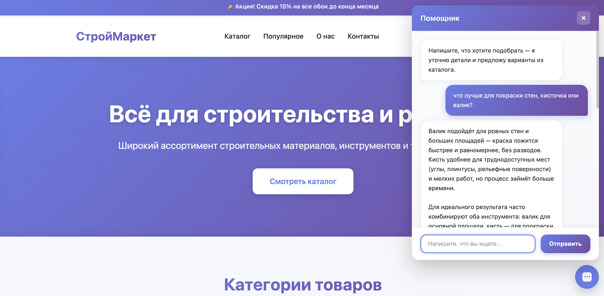

# AI Shopping Assistant

AI-ассистент для подбора товаров из каталога через чат: встраиваемый виджет и демо-страница для проверки.

---

## Задача, аудитория и боль

**Задача:** Ускорить подбор товаров и консультации в онлайн-магазине строительных товаров. Для задач клиентов система собирает корзины товаров «под ключ» — полный набор необходимых товаров для решения задачи.

**Для кого:** Покупатели строительных товаров, консультанты магазина, обрабатывающие поток запросов на подбор товаров.

**Боль сейчас:**

* Ручной поиск товаров в каталоге занимает значительное время
* Субъективность в рекомендациях товаров без понимания контекста запроса
* Долгий цикл от запроса до получения рекомендаций
* Высокая нагрузка на консультантов при росте объёма запросов
* Неоднозначные запросы пользователей требуют множественных уточняющих вопросов

---

## Что именно сделает PoC на демо

В коде режимы называются **`consultation`** (вопрос и консультация) и **`task`** (подбор под задачу). Каталог — **SQLite**, таблица **`products`**, файл по умолчанию **`back/database/products.db`**.

### `consultation` — ответ на вопрос

* Принимает вопрос (например: «Что лучше для покраски стен, кисточка или валик?»)
* Даёт экспертский ответ через LLM
* Параллельно выделяет сущности из запроса через LLM (например: «краска, кисточка, валик»)
* Ищет товары в каталоге: **BM25** по текстовым полям
* **Результат:** ответ + карточки найденных товаров при наличии в каталоге

### `task` — набор товаров под задачу

* Принимает описание задачи (например: «Хочу повесить шторы» или «Нужно поклеить обои в комнате»)
* При необходимости уточняет критичные параметры через LLM (например: материал стены)
* Формирует полный список нужных позиций через LLM
* Для каждой позиции — поиск в каталоге (**BM25**)
* **Результат:** набор «под ключ», сгруппированный по категориям

---

## LLM-провайдер

Запросы к языковой модели выполняются через [OpenAI API](https://platform.openai.com/docs/api-reference/chat) (Chat Completions). Для запуска достаточно **`OPENAI_API_KEY`** в файле **`.env`** (шаблон — **`.env.example`**). Опционально: **`OPENAI_MODEL`** (по умолчанию в коде — `gpt-4o-mini`). Подробнее о переменных — `docs/specs/serving-config.md`, `docs/specs/tools-apis.md`.

---

## Edge cases на демо

* Неоднозначные запросы — уточняющие вопросы перед подбором
* Пустая выдача по каталогу — объяснение и общие рекомендации без «сырой» ошибки
* Сбои и некорректные ответы LLM — повтор запроса или fallback на безопасный шаблонный ответ

---

## Что НЕ делает PoC (out-of-scope)

* Интеграция в продакшн-сайт магазина: единый каталог/SKU, корзина, авторизация, единый UX со страницами товара
* Интеграция с корзиной и системой заказов магазина
* Production-ready масштабирование и обработка высокой нагрузки
* Реальная обработка заказов и доставка товаров
* Интеграция с платежными системами магазина
* Сертификация для production в регулируемой среде

---

## Как запустить в Docker

1. В корне репозитория создайте `.env` с ключом OpenAI ([получить ключ](https://platform.openai.com/api-keys)):

```bash
cp .env.example .env
```

В `.env` достаточно одной строки (остальное не обязательно — см. **LLM-провайдер**):

```env
OPENAI_API_KEY=your_openai_api_key_here
```

2. Запуск:

```bash
docker compose up -d --build
```

3. Проверка: **`http://localhost:8001`** — чат и виджет; **`http://localhost:8501`** — Streamlit (история и логи запросов к модели).

---

## Демо-страница


