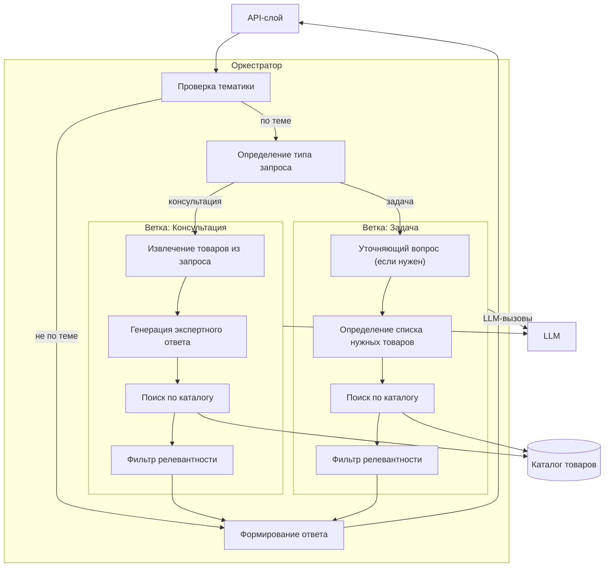

# Диаграмма компонентов — Оркестратор

## Параметры

| Параметр | Значение |
|-----------|:-------:|
| Товаров из поиска до фильтрации | 60 |
| Товаров в финальном ответе | 5 |
| Максимум уточняющих вопросов | 2 |
