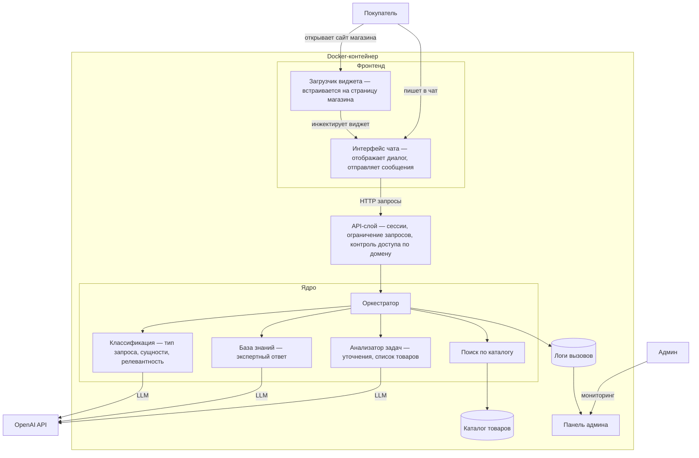

# Диаграмма контейнеров — AI Shopping Assistant

```mermaid
flowchart TB
    buyer["Покупатель"]
    admin["Админ"]
    openai["OpenAI API"]

    subgraph docker["Docker-контейнер"]

        subgraph frontend["Фронтенд"]
            loader["Загрузчик виджета — встраивается на страницу магазина"]
            chatjs["Интерфейс чата — отображает диалог, отправляет сообщения"]
        end

        fastapi["API-слой — сессии, ограничение запросов, контроль доступа по домену"]

        subgraph core["Ядро"]
            orchestrator["Оркестратор"]
            intent["Классификация — тип запроса, сущности, релевантность"]
            kb["База знаний — экспертный ответ"]
            task["Анализатор задач — уточнения, список товаров"]
            retriever["Поиск по каталогу"]
        end

        sqlite[("Каталог товаров")]
        logs[("Логи вызовов")]
        dashboard["Панель админа"]
    end

    buyer -->|"открывает сайт магазина"| loader
    loader -->|"инжектирует виджет"| chatjs
    buyer -->|"пишет в чат"| chatjs
    chatjs -->|"HTTP запросы"| fastapi
    fastapi --> orchestrator
    orchestrator --> intent
    orchestrator --> kb
    orchestrator --> task
    orchestrator --> retriever
    intent -->|"LLM"| openai
    kb -->|"LLM"| openai
    task -->|"LLM"| openai
    retriever --> sqlite
    orchestrator --> logs
    logs --> dashboard
    admin -->|"мониторинг"| dashboard
```

## Порты

| Компонент | Порт |
|-----------|:----:|
| API-слой | 8001 |
| Панель админа | 8501 |
