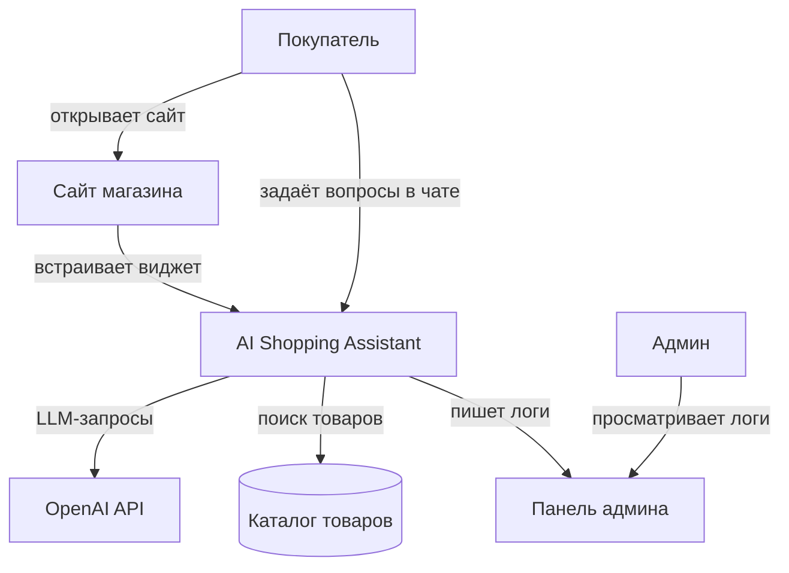

# Контекстная диаграмма — AI Shopping Assistant

## Границы системы

| Элемент | Входит в систему | Примечание |
|---------|:---:|------------|
| Чат-виджет | ✅ | Встраивается через `<script>` |
| API бэкенд | ✅ | Оркестрация, сессии |
| Поиск по каталогу | ✅ | Работает внутри процесса |
| OpenAI API | ❌ | Внешний сервис |
| Каталог товаров | ✅ | Файл в контейнере |
| Корзина / Заказы | ❌ | Бот только рекомендует товары |
| Авторизация пользователей | ❌ | Не требуется |
