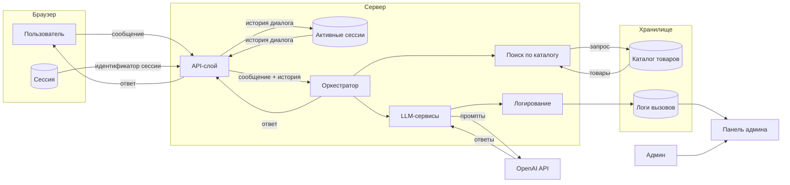

# Диаграмма потоков данных

## Что хранится

| Данные | Где | Как долго |
|--------|-----|-----------|
| Каталог товаров | SQLite-файл | Постоянно |
| Поисковый индекс | RAM | До перезапуска |
| Активные сессии + история диалога | RAM | До перезапуска, макс. 20 сообщений |
| Логи LLM-вызовов | JSON-файл | Последние 20 запросов |
| Идентификатор сессии | Браузер | До очистки браузера |

## Что не логируется

Персональные данные, API-ключи, IP-адреса пользователей, история диалогов между сессиями.
