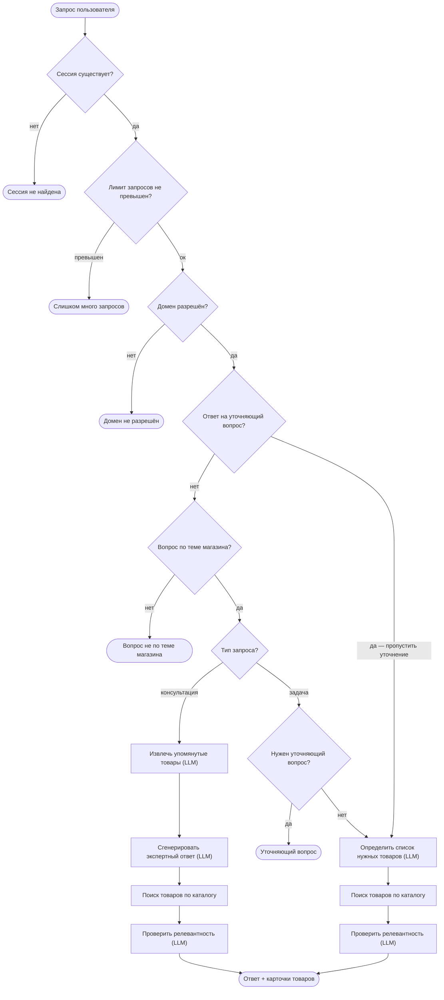

# Workflow — выполнение запроса

## Количество LLM-вызовов на запрос

| Сценарий | Вызовов | Примерное время |
|---------|:-------:|:--------------:|
| Консультация | 4–5 | 6–12 сек |
| Задача с уточнением | 3 | 5–8 сек |
| Задача без уточнения | 4–5 | 7–14 сек |
| Ответ на уточняющий вопрос | 2–3 | 4–8 сек |
| Вопрос не по теме | 1 | 1–2 сек |

## Поведение при ошибках LLM

| Шаг | При ошибке |
|-----|-----------|
| Проверка тематики | Считаем «не по теме» |
| Классификация типа | Считаем «задача» |
| Уточняющий вопрос | Пропускаем уточнение |
| Список товаров | Пустой список — сообщение об ошибке |
| Фильтр релевантности | Все товары считаются релевантными |
